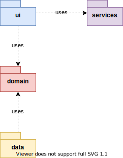
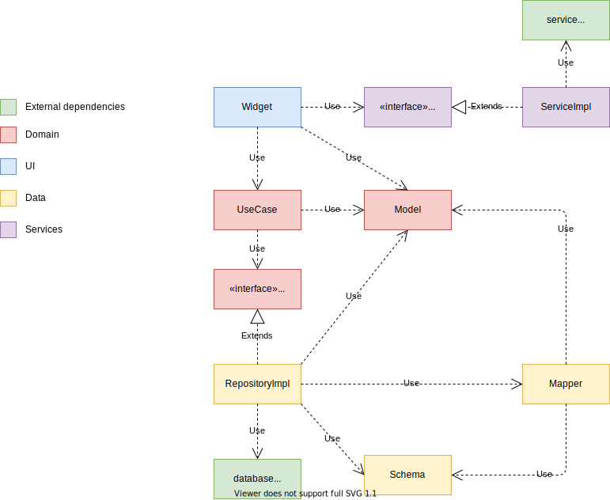

# Download  
https://play.google.com/store/apps/details?id=dev.carlosfelipe.flashcards

# Architecture  

### Flutter
  version: 2.2.3

### Layers and dependencies  
/ domain - defines the business logic of the application.  
/ data - contains everything related to data access.  
/ ui - contains everything related to user interface.  
/ services - contains services that communicates directly with the platform.  

  
  